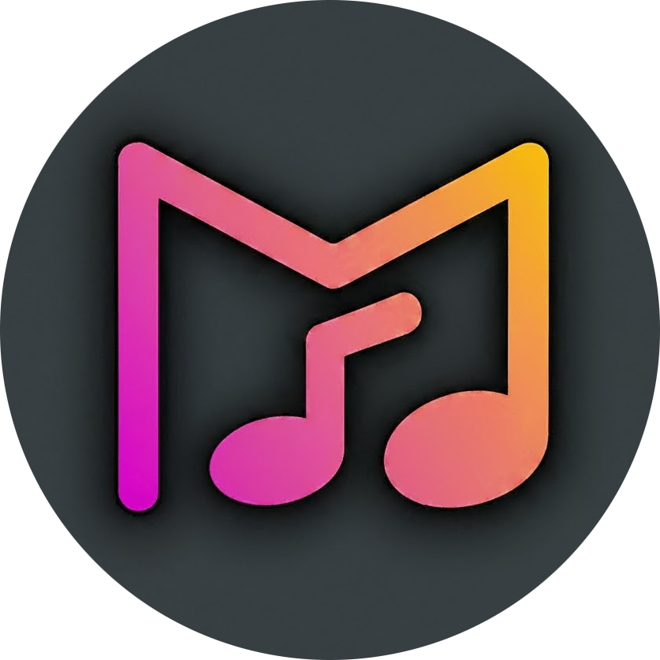
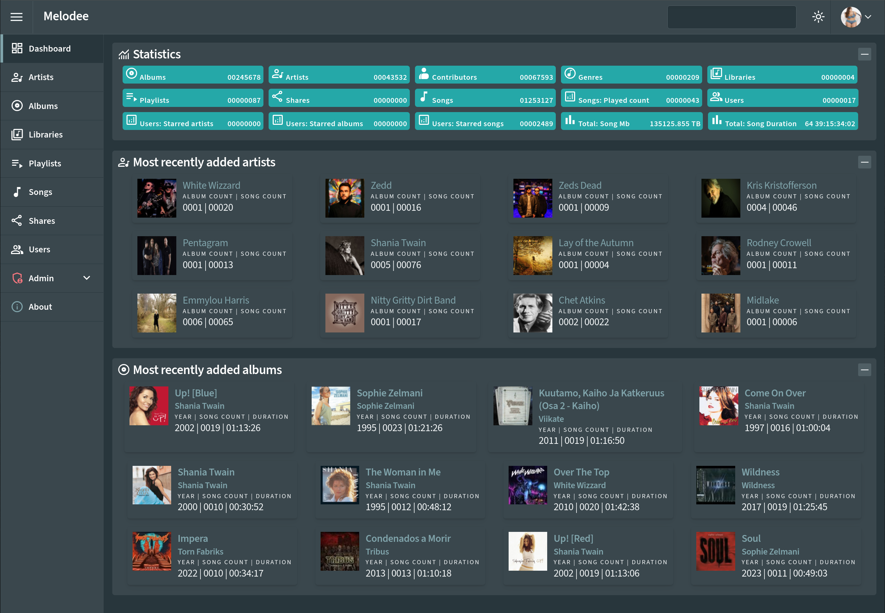

<div align="center">
  

  # Melodee

  **A modern music system designed to manage and stream music libraries with tens of millions of songs**

  [](https://opensource.org/licenses/MIT)
  [](https://github.com/sphildreth/melodee/actions/workflows/dotnet.yml)
  [](https://github.com/sphildreth/melodee/actions/workflows/github-code-scanning/codeql)
  [](https://discord.gg/bfMnEUrvbp)

  [Features](#features) • [Quick Start](#quick-start) • [Documentation](#documentation) • [Contributing](#contributing) • [Support](#support)
</div>

---

## 🎵 Overview

Melodee is a comprehensive music management and streaming system built with .NET 9 and Blazor. It provides a complete solution for processing, organizing, and serving large music libraries through OpenSubsonic-compatible APIs.

### Key Capabilities

- **📁 Smart Media Processing**: Automatically converts, cleans, and validates inbound media
- **🎛️ Staging Workflow**: Manual editing capabilities before adding to production libraries
- **🔄 Automated Jobs**: Cron-like scheduling for library scanning and updates
- **🎵 OpenSubsonic API**: Compatible with popular Subsonic and OpenSubsonic clients
- **🌐 Melodee API**: Fast restful API
- **🌐 Modern Web UI**: Blazor Server interface with Radzen UI components
- **🐳 Container Ready**: Full Docker/Podman support with PostgreSQL



## 🚀 Quick Start

### Prerequisites

- [Podman](https://podman.io/) or Docker
- [Podman Compose](https://github.com/containers/podman-compose) (for Podman users)

### 🐳 Deploy with Podman

1. **Clone the repository**
   ```bash
   git clone https://github.com/sphildreth/melodee.git
   cd melodee
   ```

2. **Configure environment variables**
   ```bash
   # Copy and edit the environment file
   cp podman.env .env
   nano .env
   ```

   Update the following variables in `.env`:
   ```bash
   # Database password (change this!)
   DB_PASSWORD=your_secure_password_here

   # Port configuration
   MELODEE_PORT=8080
   ```

3. **Deploy the application**
   ```bash
   # Using Podman Compose
   podman-compose --env-file .env up -d

   # Or using Docker Compose
   docker-compose --env-file .env up -d
   ```

4. **Access the application**
   - Web Interface: http://localhost:8080
   - Default admin credentials will be displayed in the container logs

### 📦 Updating Melodee

To update to the latest version:

```bash
# Stop the current deployment
podman-compose down

# Pull the latest changes
git pull origin main

# Rebuild and restart
podman-compose --env-file .env up -d --build
```

> **Note**: Database migrations are handled automatically during container startup.

### 🗂️ Volume Management

Melodee uses several persistent volumes for data storage:

| Volume | Purpose | Description                                 |
|--------|---------|---------------------------------------------|
| `melodee_storage` | Music Library | Processed and organized music files         |
| `melodee_inbound` | Incoming Media | New media files to be processed             |
| `melodee_staging` | Staging Area | Media ready for manual review               |
| `melodee_user_images` | User Content | User-uploaded avatars            |
| `melodee_playlists` | Playlists | Admin defined (json base) dynamic playlists |
| `melodee_db_data` | Database | PostgreSQL data                             |

To backup your data:
```bash
# Backup volumes
podman volume export melodee_storage > melodee_storage_backup.tar
podman volume export melodee_db_data > melodee_db_backup.tar

# Restore volumes
podman volume import melodee_storage melodee_storage_backup.tar
podman volume import melodee_db_data melodee_db_backup.tar
```

## ✨ Features

### 🎛️ Media Processing Pipeline

1. **Inbound Processing**
   - Converts media to standard formats
   - Applies regex-based metadata rules
   - Validates file integrity and metadata

2. **Staging Management**
   - Manual editing of metadata before production
   - Album art management
   - Quality control workflow

3. **Production Libraries**
   - Automated scanning and indexing
   - Multiple storage library support
   - Real-time updates

### 🔌 Plugin Architecture

- **Media Format Support**: AAC, AC3, M4A, FLAC, OGG, APE, MP3, WAV, WMA, and more
- **Metadata Sources**: iTunes, Last.FM, MusicBrainz, Spotify
- **File Parsers**: NFO, M3U, SFV metadata files

### 🌐 OpenSubsonic API

Full compatibility with Subsonic 1.16.1 and OpenSubsonic specifications:

- Real-time transcoding (including OGG and Opus)
- Playlist management
- User authentication and permissions
- Album art and metadata serving

#### Tested Clients

- [Airsonic (refix)](https://github.com/tamland/airsonic-refix)
- [Dsub](https://github.com/DataBiosphere/dsub)
- [Feishin](https://github.com/jeffvli/feishin)
- [Symphonium](https://symfonium.app/)
- [Sublime Music](https://github.com/sublime-music/sublime-music)
- [Supersonic](https://github.com/dweymouth/supersonic)
- [Ultrasonic](https://gitlab.com/ultrasonic/ultrasonic)

### 🎯 Job Engine

- Cron-like scheduling system
- Configurable scan intervals
- Background processing
- Progress monitoring

## 🏗️ Architecture

### Components

| Component | Description | Technology |
|-----------|-------------|------------|
| **Melodee.Blazor** | Web UI and OpenSubsonic API server | Blazor Server, Radzen UI |
| **Melodee.Cli** | Command-line interface | .NET Console App |
| **Melodee.Common** | Shared libraries and services | .NET Class Library |

### System Requirements

- **.NET 9.0** or later
- **PostgreSQL 17** (included in container deployment)
- **2GB RAM** minimum (4GB recommended)
- **Storage**: Varies based on music library size

## 📚 Documentation

- [Installation Guide](docs/installation.md)
- [Configuration Reference](docs/configuration.md)
- [API Documentation](docs/api.md)
- [Plugin Development](docs/plugins.md)
- [Troubleshooting](docs/troubleshooting.md)

## 🤝 Contributing

We welcome contributions! Please see our [Contributing Guide](CONTRIBUTING.md) for details.

### Development Setup

1. **Clone the repository**
   ```bash
   git clone https://github.com/sphildreth/melodee.git
   cd melodee
   ```

2. **Install .NET 9 SDK**
   ```bash
   # Follow instructions at https://dotnet.microsoft.com/download
   ```

3. **Run locally**
   ```bash
   dotnet run --project src/Melodee.Blazor
   ```

### Code of Conduct

This project adheres to the [Contributor Covenant Code of Conduct](CODE_OF_CONDUCT.md).

## 📄 License

This project is licensed under the MIT License - see the [LICENSE](LICENSE) file for details.

## 💬 Support

- **Melodee Music System**: [Home](https://melodee.org)
- **Discord**: [Join our community](https://discord.gg/bfMnEUrvbp)
- **Issues**: [GitHub Issues](https://github.com/sphildreth/melodee/issues)
- **Discussions**: [GitHub Discussions](https://github.com/sphildreth/melodee/discussions)

## 🙏 Acknowledgments

- Built with [.NET 9](https://dotnet.microsoft.com/)
- UI powered by [Radzen Blazor Components](https://blazor.radzen.com/)
- Compatible with [OpenSubsonic](https://opensubsonic.netlify.app/) specification
- Music metadata from [MusicBrainz](https://musicbrainz.org/), [Last.FM](https://last.fm/), and [Spotify](https://spotify.com/)

---

<div align="center">
  Made with ❤️ by the Melodee community
</div>
